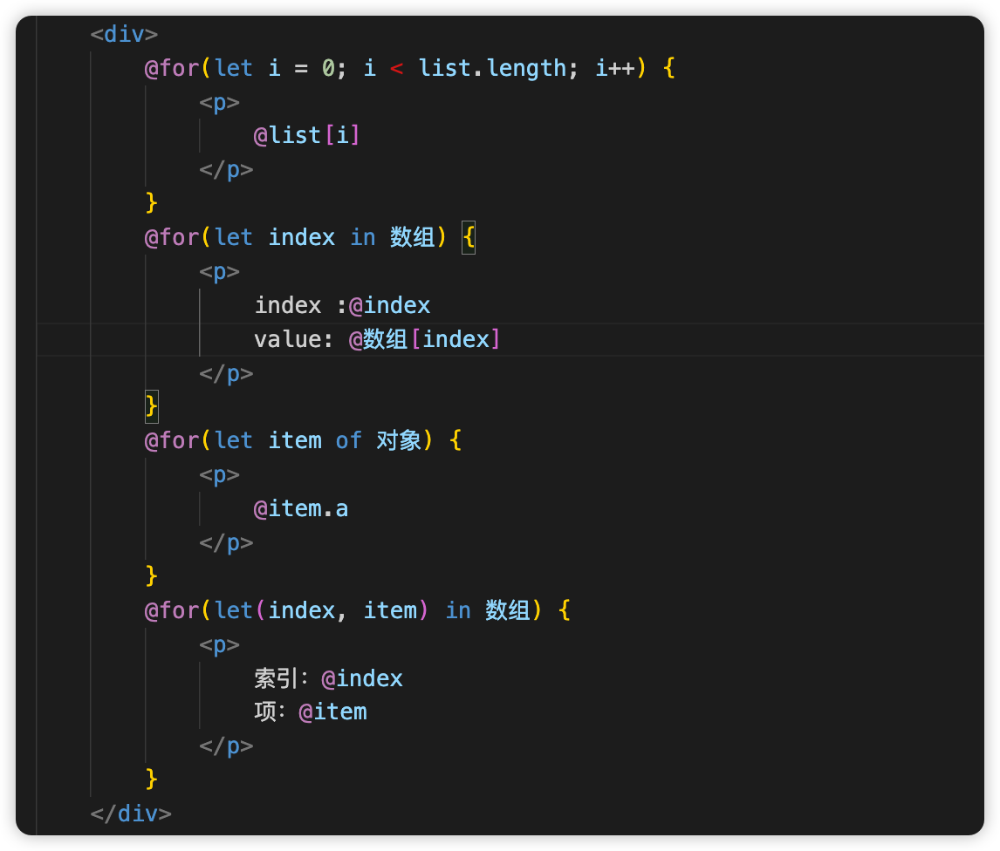

# Joker  

A Front-End Framework with a Built-in Low-Code Platform
[Low-Code Platform](https://lowcode.jokers.pub)

Joker is a framework platform designed to support all development scenarios. Among them, Joker.front is the front-end development framework under the Joker platform. It provides standardized front-end development standards and uses an object-oriented and component-based programming model to help you develop user interfaces efficiently. Whether it is a simple or complex interface, Joker.front can handle it with ease.

## What is Joker?

Joker is a framework platform that aims to support all development scenarios. Specifically, Joker.front, which is part of the Joker platform, is a front-end development framework. It offers standardized front-end development norms and employs an object-oriented and component-based programming approach to assist in the efficient creation of user interfaces. Regardless of whether the interface is simple or intricate, Joker.front can manage it smoothly.

Joker is an all-round development platform constructed with TypeScript. It exhibits outstanding performance and stability, whether dealing with basic interface development requirements or complex user interface tasks. It encompasses the following significant features:

-   **Powerful Extensibility**: Joker offers a component-based framework. With extensibility in mind during its initial design, it can be effortlessly integrated into existing projects or systems and supports the construction of scalable web applications, enabling customized development according to project needs.
-   **Abundant Component Library**: Joker.front provides a comprehensive set of front-end component libraries. These include carefully designed and optimized features and UI components such as routing and scaffolding, which assist developers in rapidly constructing aesthetically pleasing and high-performance user interfaces.
-   **Comprehensive Development Tools**: To further enhance development efficiency, Joker also supplies a series of supporting development tools, including debugging and building tools. These thoughtfully designed tools are intended to streamline the development process, facilitating developers in accurately and swiftly developing, building, testing, and updating code.
-   **Class API**: Joker utilizes TypeScript as the scripting development standard and adopts the standard Class API as the development guideline, which better aligns with object-oriented development requirements.
-   **Responsiveness**: Joker automatically tracks the state of JavaScript and updates the DOM in a reactive manner when changes occur. The reactive updates are instantaneous and do not involve virtual DOM difference comparison.

## More User-Friendly Command Syntax




## How to Use

You can utilize the Joker CLI to create projects, generate application and library code, and carry out various continuous development tasks such as testing, packaging, and deployment.

To install the Joker CLI, open a terminal/console window and execute the following command:

```
pnpm i -g @joker.front/cli
```

1. Run the CLI command **joker create** and supply the name my-app as a parameter, as shown below:

```
joker create my-app
```

2. In the my-app working directory, install the dependencies.

```
cd my-app

pnpm i
```

The CLI will create a new workspace and a simple welcome application that you can run at any time.

## Running the Application

The Joker CLI includes a server command and a build command. The server command enables you to build and serve applications locally.

We provide two commands by default, namely `dev` and `build`, representing the development environment and code building respectively.

1. Navigate to the workspace folder, such as my-app.

```
cd my-app
```

2. Run the following command:

```
npm run dev
```

Upon successful execution, a simple sample page will be displayed.

## Documentation

[Official Website](http://front.jokers.pub)
[Official UI Library](http://ui.jokers.pub)
[Low-Code Platform](http://jokers.pub)

# Joker

一个自带低代码平台的前端框架
[低代码平台](https://lowcode.jokers.pub)

Joker 是一个旨在为所有开发场景提供支持的框架平台。其中，Joker.front 是 Joker 平台下的前端开发框架，它提供标准化的前端开发标准，采用面向对象、组件化的编程模型，助力您高效开发用户界面。无论是简单还是复杂的界面，Joker.front 都能轻松应对。

## 什么是 Joker？

Joker 是一个致力于为所有开发场景提供支持的框架平台。其中，Joker.front 作为 Joker 平台的一部分，是一个前端开发框架。它提供标准化的前端开发规范，并运用面向对象和组件化的编程方式来协助高效构建用户界面。不管界面是简单还是复杂，Joker.front 都能顺利处理。

Joker 是一个基于 TypeScript 构建的全能开发平台。无论是应对简单的界面开发需求，还是处理复杂的用户界面任务，它都展现出卓越的性能与稳定性。它具备以下重要特性：

-   **强大的可扩展性**：Joker 提供基于组件的框架。其在设计之初就考虑到了扩展性，因此能够轻松集成到现有项目或系统中，支持构建可伸缩的 Web 应用，可根据项目需求进行定制化开发。
-   **丰富的组件库**：Joker.front 提供了一套完备的前端组件库，包括路由、脚手架等经过精心设计与优化的功能和 UI 组件，能够帮助开发者快速构建出美观且高性能的用户界面。
-   **完善的开发工具**：为进一步提升开发效率，Joker 还提供了一系列配套的开发工具，包括调试工具、构建工具等。这些精心设计的工具旨在让开发流程更加顺畅，助力开发者准确快速地开发、构建、测试以及更新代码。
-   **Class API**：Joker 以 TypeScript 作为脚本开发标准，并采用标准的 Class API 作为开发规范，更契合面向对象开发的要求。
-   **响应性**：Joker 会自动追踪 JavaScript 状态，当其发生变化时能即时响应式地更新 DOM，且不存在虚拟 DOM 的差异对比。

## 更友好的命令语法


## 如何使用

您可以使用 Joker CLI 来创建项目、生成应用和库代码，以及执行各类持续开发任务，如测试、打包和部署。

要安装 Joker CLI，请打开终端/控制台窗口，并运行如下命令：

```
pnpm i -g @joker.front/cli
```

1. 运行 CLI 命令 **joker create** 并提供 my-app 名称作为参数，如下所示：

```
joker create my-app
```

2. 在 my-app 工作目录下，安装依赖项。

```
cd my-app

pnpm i
```

CLI 将创建一个新的工作区以及一个简单的欢迎应用，您可以随时运行它。

## 运行应用

Joker CLI 包含一个服务器命令以及一个构建命令，服务器命令便于您在本地构建并提供应用服务。

我们默认提供了`dev`和`build`两个命令，分别代表开发环境和代码构建。

1. 导航至工作区文件夹，比如 my-app。

```
cd my-app
```

2. 运行以下命令：

```
npm run dev
```

成功运行后，将会显示一个简单的示例页面。

## 文档

[官网](http://front.jokers.pub)
[官方 UI 库](http://ui.jokers.pub)
[低代码平台](http://jokers.pub)
